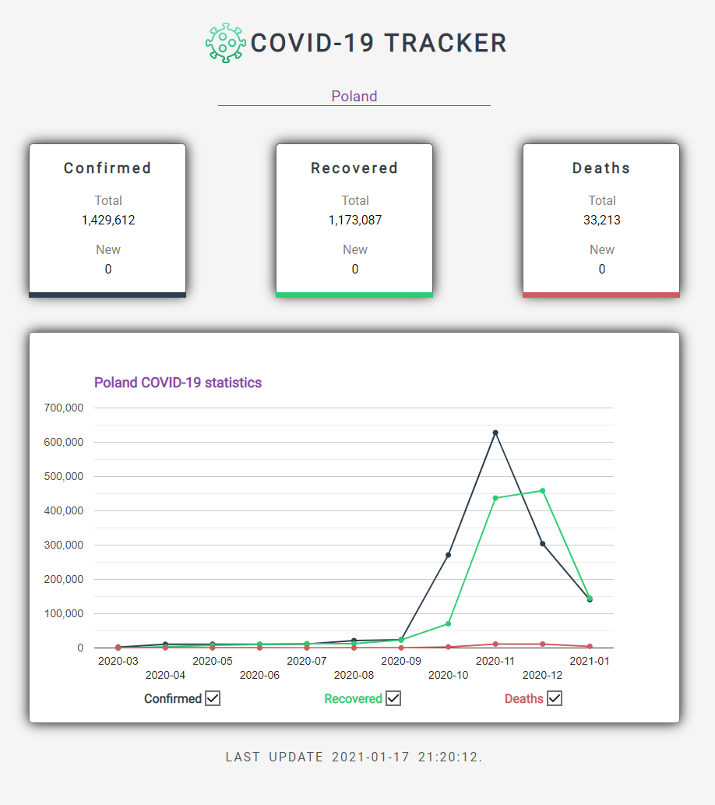
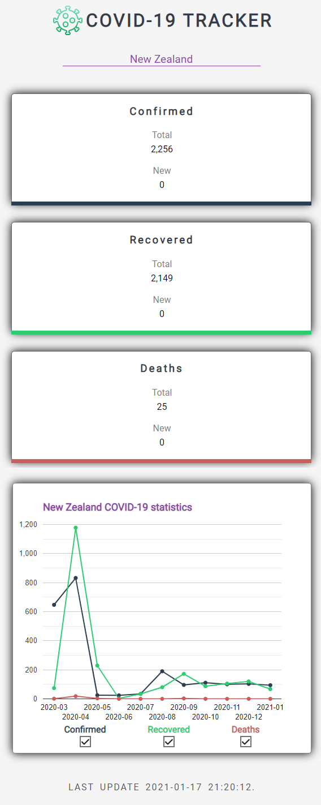

## Jump to section
* [About](#about)
* [Visuals](#visuals)
* [Technologies](*technologies)
* [Authors](#authors)

## About
* COVID-19-tracker is a full stack web aplication allowing users to check live COVID-19 statistics from all around the world.

### Back-end
* fully written in JavaScript in node using express.js framework
* fetching live data from https://documenter.getpostman.com/view/10808728/SzS8rjbc api

### Front-end
* Fully responsive, modern and clean UI
* Using Google charts api to display covid-19 statistics on chart

## Visuals
* Dekstop view

* Mobile view

## Technologies
* JavaScript
* Node.js
* Express.js

## Authors
* xlegodroit
